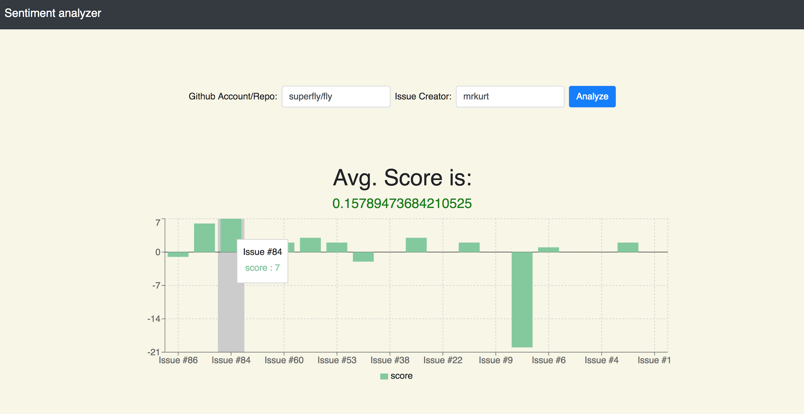

# 📊Sentiment Analyzer
It calls Github's GraphQL API to get a list of issues opened by an user and analyzes their sentiment. 

PS: It only analyzes the main issue body (not comments).

# Installation
This project has both the server(Express) and the client (React). The main root directory contains the Express sever, and the `/client` directory contains the React project.

## Running it in the cloud
For convienience, this repo already has production client build built. So you should be able to upload it directly to any cloud.

1. `git clone https://github.com/rajaraodv/sentiment-analyzer.git`
2. `cd sentiment-analyzer`
3. Set the environment variable `GITHUB_API_TOKEN` to your personal Github access token.
4. Upload

## Running it locally
### Steps (Server)

1. `git clone https://github.com/rajaraodv/sentiment-analyzer.git`
2. `cd sentiment-analyzer`
3. `touch .env`  //👈🏼👈🏼 this is to safely (locally) store API token and other env variables
4. Add this line `GITHUB_API_TOKEN="<your_github_personal_access_token>"` and add your Github's token and save the `.env` file
5. `npm install`
6. `npm start`

Note: The server will run on port 3001

### Steps (Client)

1. Open a different Terminal tab 
2. `cd sentiment-analyzer/client`
3. `npm install`
4. `npm start`
5. Open browser at `localhost:3000`

Note: The client dev-server will run on port 3000 (but it proxies the requests to port 3001)

## Creating production build

Note: Only the client steps changes for production builds.

1. Open different Terminal tab 
2. `cd sentiment-analyzer/client`
3. `npm install`
4. `npm run build` //👈🏼👈🏼 This builds a prod build in `client/build`  

Note: The server can directly serve the prod if you open `localhost:3001` where the server is running (instead of the dev-server that's running at `localhost:3000`)

